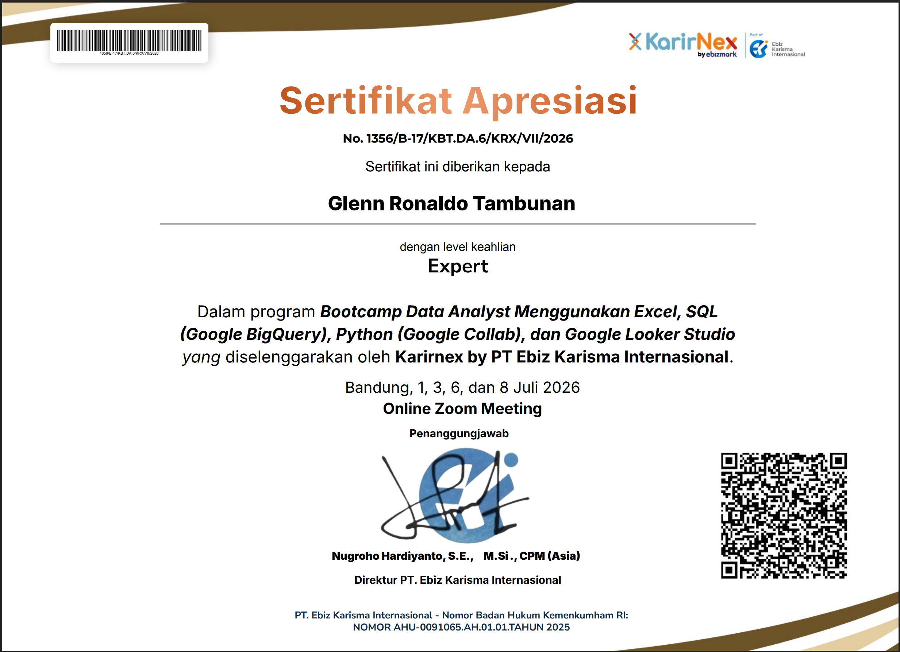
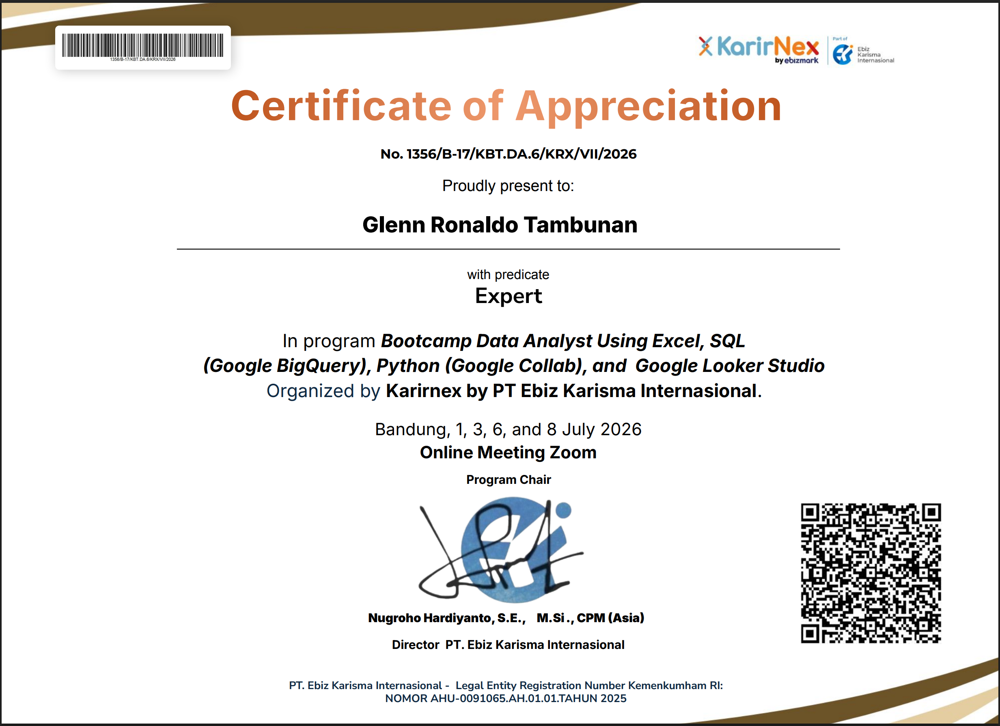
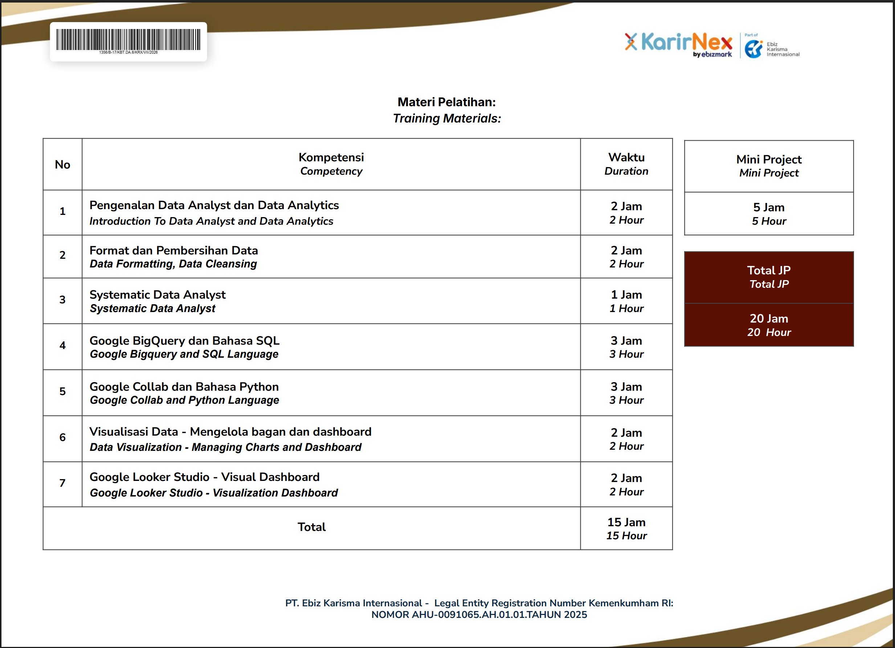

# Kitchen Equipment Sales Analysis

## Gambaran Proyek

Proyek ini berfokus pada analisis data penjualan peralatan dapur untuk menghasilkan business insight mengenai sales performance, product performance, customer behavior, dan operational metrics.

Analisis dilakukan melalui end-to-end Data Analytics workflow yang mencakup data preparation, data cleaning, SQL analysis, Exploratory Data Analysis menggunakan Python, serta dashboard visualization menggunakan Looker Studio.

Proyek ini dikembangkan sebagai bagian dari **KarirNex Data Analyst Bootcamp Batch 6** dengan menerapkan keterampilan praktis menggunakan Microsoft Excel, Google BigQuery, Python, dan Google Looker Studio.

---

## Tujuan Bisnis

Proyek ini bertujuan untuk:

- Menganalisis sales performance dan revenue trend secara keseluruhan.
- Mengidentifikasi top-performing products berdasarkan jumlah unit terjual dan kontribusi revenue.
- Menganalisis customer purchasing behavior dan pola transaksi pelanggan.
- Mengevaluasi operational metrics, seperti shipping fee dan refund performance.
- Menghasilkan actionable insight yang dapat mendukung pengambilan keputusan bisnis.

---

## Deskripsi Dataset

Dataset yang digunakan berisi data transaksi penjualan peralatan dapur selama tahun 2025.

Informasi yang tersedia dalam dataset meliputi:

- Order information
- Product name dan product category
- Customer information
- Sales date
- Quantity
- Total sales
- Shipping fee
- Discount
- Transaction status
- City

Dataset diproses melalui beberapa tahapan, mulai dari data cleaning dan validation menggunakan Microsoft Excel, SQL querying menggunakan Google BigQuery, Exploratory Data Analysis menggunakan Python, hingga pengembangan dashboard menggunakan Looker Studio.

---

## Tools & Technologies

Tools dan teknologi yang digunakan dalam proyek ini adalah:

| Kategori | Tools |
|---|---|
| Data Processing | Microsoft Excel |
| Data Analysis | SQL dan Google BigQuery |
| Exploratory Data Analysis | Python, Pandas, NumPy, dan Matplotlib |
| Data Visualization | Google Looker Studio |
| Documentation | Jupyter Notebook dan PDF Report |

---

## Alur Pengerjaan Proyek

Proyek ini diselesaikan melalui empat tahapan utama dalam end-to-end Data Analytics workflow.

### 1. Data Preparation & Cleaning — Microsoft Excel

Tahap pertama berfokus pada persiapan dan pembersihan raw data menggunakan Microsoft Excel.

Aktivitas yang dilakukan meliputi:

- Menangani missing value dan data yang tidak konsisten.
- Memeriksa struktur data dan data type.
- Mengidentifikasi serta menghapus duplicate records.
- Menstandarkan format data.
- Menyiapkan clean dataset untuk proses analisis selanjutnya.

**Tools:**

- Microsoft Excel

---

### 2. SQL Analysis — Google BigQuery

SQL analysis dilakukan untuk menjawab business questions dan mengekstrak informasi penting dari clean dataset.

Analisis yang dilakukan meliputi:

- Shipping fee analysis
- Top-selling product analysis
- Product revenue contribution
- Quarterly sales analysis
- Refund performance analysis
- Average product quantity analysis
- Monthly category performance
- Pareto analysis
- Customer purchasing behavior
- Customer transaction gap
- Product refund rate analysis

**Tools:**

- SQL
- Google BigQuery

---

### 3. Exploratory Data Analysis — Python

Exploratory Data Analysis dilakukan untuk memahami karakteristik dataset, mengidentifikasi pola penjualan, serta menghasilkan visualisasi yang mendukung proses interpretasi data.

Aktivitas yang dilakukan meliputi:

- Data loading dan data inspection
- Data cleaning validation
- Statistical summary analysis
- Distribution analysis
- Data aggregation
- Data visualization
- Business insight generation

**Tools:**

- Python
- Pandas
- NumPy
- Matplotlib
- Jupyter Notebook

---

### 4. Dashboard Development & Visualization

Tahap terakhir berfokus pada penyajian hasil analisis dalam bentuk interactive dashboard menggunakan Google Looker Studio.

Dashboard mencakup:

- Total sales
- Total orders
- Completed order rate
- Monthly sales trend
- Sales contribution by category
- Sales distribution by city
- Top-selling products
- Interactive filters berdasarkan category, status, dan city
- Insight dan business recommendation

**Tools:**

- Google Looker Studio

---

## Preview Dashboard

Dashboard dikembangkan menggunakan Google Looker Studio untuk memvisualisasikan sales performance dan menyajikan business insight secara interaktif.

Dashboard membantu pengguna dalam:

- Memantau overall sales performance.
- Menganalisis monthly revenue trend.
- Mengevaluasi product dan category performance.
- Mengidentifikasi sales distribution berdasarkan city.
- Memantau completed order rate.
- Mendukung data-driven decision-making.


### Interactive Dashboard

Link interactive dashboard tersedia pada file berikut:

`dashboard/looker-studio-dashboard-link.txt`

---

## Sertifikat Bootcamp

Proyek ini dikembangkan sebagai bagian dari **KarirNex Data Analyst Bootcamp Batch 6**.

Program bootcamp mencakup pengembangan keterampilan praktis dalam bidang Data Analytics, antara lain:

- Introduction to Data Analyst and Data Analytics
- Data Formatting and Data Cleaning
- Systematic Data Analysis
- SQL Analysis menggunakan Google BigQuery
- Python Analysis menggunakan Google Colab
- Data Visualization dan Dashboard Development
- Google Looker Studio
- Mini Project

Berikut merupakan sertifikat penyelesaian program:







Dokumen sertifikat lengkap dapat diakses melalui:

`certificate/KarirNex_Data_Analyst_Expert_Certificate.pdf`

---

## Insight Utama

Berdasarkan hasil analisis, diperoleh beberapa business insight berikut.

### Sales Performance

- Dashboard mencatat total sales sekitar **Rp5,9 miliar** dari **10.000 orders**, dengan completed order rate sebesar **89,7%**.
- Monthly sales menunjukkan pola yang relatif stabil sepanjang tahun 2025, yaitu sekitar **Rp453,1 juta hingga Rp523,8 juta per bulan**.
- Sales tertinggi terjadi pada **Agustus 2025** sebesar **Rp523,8 juta**, sedangkan sales terendah terjadi pada **Februari 2025** sebesar **Rp453,1 juta**.
- Pada kuartal IV tahun 2025, terdapat **2.156 completed orders** dengan total revenue sebesar **Rp1,295 miliar**.

### Product Performance

- Berdasarkan transaksi berstatus completed, **Mesin Kopi Espresso Rumahan** menghasilkan revenue tertinggi sebesar **Rp640,22 juta**, diikuti oleh **Food Processor** sebesar **Rp447,39 juta**.
- Produk dengan jumlah unit terjual tertinggi adalah **Tempat Tisu Meja sebanyak 370 unit**, **Cobek Granit sebanyak 365 unit**, dan **Keranjang Buah Besi sebanyak 361 unit**.
- Kategori **Alat Masak** menjadi kontributor utama dengan menyumbang sekitar **79,5% dari total sales**.
- Pareto analysis menunjukkan bahwa sebagian produk dengan revenue tertinggi memberikan kontribusi yang dominan terhadap total pendapatan.

### Customer Behavior

- Analisis transaction gap menunjukkan adanya perbedaan frekuensi pembelian antar pelanggan.
- Pelanggan dengan rata-rata transaction gap paling pendek adalah **Customer_3 sebesar 9,9 hari**, **Customer_9 sebesar 10,1 hari**, dan **Customer_5 sebesar 11 hari**.
- Pelanggan dengan transaction gap yang pendek dapat diprioritaskan dalam customer retention program, loyalty program, dan personalized promotion.

### Operational Metrics

- Total shipping fee mencapai **Rp570,16 juta**, dengan rata-rata shipping fee sebesar **Rp57.016 per transaksi**.
- Total refund value mencapai **Rp279,71 juta** atau sekitar **4,76% dari gross revenue**.
- Produk dengan refund rate tertinggi adalah **Panci Stainless 20 cm sebesar 8,29%**, **Talenan Kayu Jati sebesar 7,75%**, dan **Wadah Makanan Kedap Udara Set sebesar 7,65%**.
- Produk dengan refund rate tinggi memerlukan evaluasi lebih lanjut terhadap product quality, packaging, product description, dan proses pengiriman.

---

## Struktur Proyek

Repository disusun berdasarkan tahapan end-to-end Data Analytics workflow, mulai dari data preparation, analysis, visualization, hingga documentation.

```text
kitchen-equipment-sales-analysis/
│
├── certificate/
│   ├── KarirNex_Data_Analyst_Certificate_Page1.png
│   ├── KarirNex_Data_Analyst_Certificate_Page2.png
│   ├── KarirNex_Data_Analyst_Certificate_Page3.png
│   └── KarirNex_Data_Analyst_Expert_Certificate.pdf
│
├── dashboard/
│   ├── kitchen-equipment-sales-dashboard.png
│   └── looker-studio-dashboard-link.txt
│
├── data/
│   ├── Day-1-Excel/
│   ├── Day-2-SQL/
│   ├── Day-3-Python/
│   └── Day-4-Looker-Studio/
│
├── excel/
│   └── Kitchen_Equipment_Sales_Analysis.xlsx
│
├── python/
│   └── Kitchen_Equipment_EDA.ipynb
│
├── report/
│   └── Kitchen_Equipment_Sales_Analysis_Report.pdf
│
├── sql/
│   ├── day-2-bigquery/
│   │   ├── query_01_shipping_fee.sql
│   │   ├── query_02_top_product.sql
│   │   ├── query_02_top_revenue.sql
│   │   ├── query_03_quarter_sales.sql
│   │   ├── query_04_average_shipping.sql
│   │   ├── query_05_refund_analysis.sql
│   │   ├── query_06_product_quantity.sql
│   │   ├── query_07_category_monthly.sql
│   │   ├── query_08_pareto_analysis.sql
│   │   ├── query_09_customer_gap.sql
│   │   └── query_10_highest_refund.sql
│   │
│   └── day-2-output/
│       ├── query_01_shipping_fee_output.csv
│       ├── query_02_top_product_output.csv
│       ├── query_02_top_revenue_output.csv
│       ├── query_03_quarter_sales_output.csv
│       ├── query_04_average_shipping_output.csv
│       ├── query_05_refund_analysis_output.csv
│       ├── query_06_product_quantity_output.csv
│       ├── query_07_category_monthly_output.csv
│       ├── query_08_pareto_analysis_output.csv
│       ├── query_09_customer_gap_output.csv
│       └── query_10_highest_refund_output.csv
│
└── README.md
```

---

## Sorotan Proyek

- Mengembangkan end-to-end Data Analytics project yang mencakup data preparation, SQL analysis, Python EDA, dan dashboard visualization.
- Menyelesaikan analisis untuk **10 business questions** menggunakan Google BigQuery.
- Menyediakan file SQL query beserta query output dalam format CSV.
- Mengembangkan interactive sales performance dashboard menggunakan Google Looker Studio.
- Menghasilkan business insight terkait sales performance, product contribution, customer behavior, dan operational metrics.
- Menyusun project report dan dokumentasi pendukung dalam format PDF.

---

## Author

**Glenn Ronaldo Tambunan**

Mahasiswa D3 Sistem Informasi  
Universitas Pembangunan Nasional "Veteran" Jakarta

Bidang yang diminati:

- Data Analytics
- Business Intelligence
- Data Visualization
- Data-driven Problem Solving

Technical Skills:

- Microsoft Excel
- SQL (Google BigQuery)
- Python (Pandas, NumPy, Matplotlib)
- Google Looker Studio
- Tableau
- Power BI

---

Proyek ini dikembangkan sebagai bagian dari **KarirNex Data Analyst Bootcamp Batch 6**.