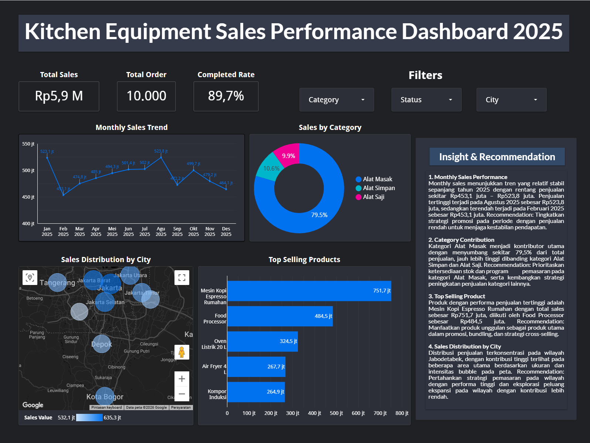

# Kitchen Equipment Sales Analysis

## Project Overview

This project focuses on analyzing kitchen equipment sales data to generate business insights related to sales performance, product performance, customer behavior, and operational metrics.

The analysis was conducted through an end-to-end Data Analytics workflow, starting from data preparation, exploratory analysis, SQL-based analysis, and dashboard visualization.

This project was developed as part of the KarirNex Data Analyst Bootcamp Batch 6, applying practical data analytics techniques using Excel, SQL, Python, and data visualization tools.

---

## Business Objectives

The main objectives of this project are:

- Analyze overall sales performance and revenue trends.
- Identify top-performing products based on sales quantity and revenue contribution.
- Analyze customer purchasing behavior and transaction patterns.
- Evaluate operational metrics such as shipping fees and refund performance.
- Generate actionable insights through data analysis and visualization.

---

## Dataset Description

The dataset used in this project contains kitchen equipment sales transaction data. The dataset includes information related to orders, products, customers, sales dates, transaction status, revenue, and shipping costs.

The dataset was processed and analyzed through multiple stages, including data cleaning, exploratory data analysis, SQL querying, and dashboard development.

---

## Tools & Technologies

The following tools and technologies were used throughout this project:

| Category | Tools |
|---|---|
| Data Processing | Microsoft Excel |
| Data Analysis | SQL (Google BigQuery) |
| Exploratory Data Analysis | Python (Pandas, NumPy, Matplotlib) |
| Data Visualization | Looker Studio |
| Documentation | PDF Report |

---

## Project Workflow

This project was completed through an end-to-end data analytics workflow consisting of four main stages:

### 1. Data Preparation & Cleaning (Excel)

The initial stage focused on preparing raw sales data by performing data cleaning and validation using Microsoft Excel.

Activities performed:
- Handling missing and inconsistent data
- Checking data structure and data types
- Removing duplicate records
- Preparing clean datasets for further analysis

Tools:
- Microsoft Excel

---

### 2. SQL Analysis (Google BigQuery)

SQL analysis was conducted to extract business insights from the cleaned dataset.

Key analyses performed:
- Shipping fee analysis
- Top-performing product analysis
- Revenue contribution analysis
- Sales trend analysis
- Refund performance analysis
- Product quantity analysis
- Category sales analysis
- Pareto analysis
- Customer purchasing behavior analysis
- Customer transaction gap analysis

Tools:
- SQL
- Google BigQuery

---

### 3. Exploratory Data Analysis (Python)

Exploratory Data Analysis (EDA) was performed to understand sales patterns, identify trends, and discover important insights from the dataset.

Activities performed:
- Data exploration
- Statistical summary analysis
- Distribution analysis
- Data visualization

Tools:
- Python
- Pandas
- NumPy
- Matplotlib
- Jupyter Notebook

---

### 4. Dashboard Development & Visualization

The final stage focused on transforming analytical results into interactive visualizations to support business decision-making.

Dashboard components include:
- Sales performance overview
- Revenue analysis
- Product performance
- Customer insights
- Operational metrics

Tools:
- Looker Studio

---

## Dashboard Preview

The final dashboard was developed using Looker Studio to visualize sales performance and generate actionable business insights.

Dashboard focuses on:
- Overall sales performance monitoring
- Revenue and sales trend analysis
- Product performance evaluation
- Customer purchasing behavior
- Operational performance metrics





Interactive Dashboard:

The interactive dashboard link is available in:

`dashboard/looker-studio-dashboard-link.txt`

---

## Key Insights

Based on the analysis results, several business insights were identified:

### Sales Performance

- The analysis recorded a total revenue of approximately **Rp5.9 million** with **10,000 total orders** and a completed order rate of **89.7%** based on the dashboard performance overview.
- Monthly sales performance showed relatively stable trends throughout 2025, with the highest monthly revenue occurring in **August 2025 reaching Rp523.8 million**.

### Product Performance

- The **Mesin Kopi Espresso Rumahan** was identified as the highest revenue-contributing product with total revenue of **Rp640.2 million**, followed by **Food Processor** with **Rp447.4 million**.
- Based on sales quantity, the highest-selling products included **Tempat Tisu Meja (370 units)**, **Cobek Granit (365 units)**, and **Keranjang Buah Besi (361 units)**.
- Category analysis showed that **Alat Masak** became the dominant sales contributor, accounting for approximately **79.5% of total sales contribution**.

### Customer Behavior

- Customer purchasing behavior analysis identified repeat purchase patterns, with several customers showing transaction gaps ranging from approximately **9.9 to 12.7 days**.
- The analysis helps identify potential repeat customers and opportunities for targeted retention strategies.

### Operational Metrics

- The total shipping cost analyzed reached **Rp570.16 million**, with an average shipping fee of approximately **Rp57,016 per transaction**.
- Refund analysis showed total refund value of **Rp279.71 million**, representing approximately **4.76% of gross revenue**.
- Products with the highest refund rates included **Panci Stainless 20 cm (8.29%)**, **Talenan Kayu Jati (7.75%)**, and **Wadah Makanan Kedap Udara Set (7.65%)**, indicating products that may require further quality evaluation.

---

## Project Structure

The repository is organized based on the end-to-end data analytics workflow, starting from data preparation, analysis, visualization, and documentation.

```text
kitchen-equipment-sales-analysis/
│
├── certificate/
│   └── KarirNex_Data_Analyst_Expert_Certificate.pdf
│
├── dashboard/
│   ├── kitchen-equipment-sales-dashboard.png
│   └── looker-studio-dashboard-link.txt
│
├── data/
│   ├── Day-1-Excel/
│   ├── Day-2-SQL/
│   ├── Day-3-Python/
│   └── Day-4-Looker-Studio/
│
├── excel/
│   └── Kitchen_Equipment_Sales_Analysis.xlsx
│
├── python/
│   └── Kitchen_Equipment_EDA.ipynb
│
├── report/
│   └── Kitchen_Equipment_Sales_Analysis_Report.pdf
│
├── sql/
│   │
│   ├── day-2-bigquery/
│   │   ├── query_01_shipping_fee.sql
│   │   ├── query_02_top_product.sql
│   │   ├── query_02_top_revenue.sql
│   │   ├── query_03_quarter_sales.sql
│   │   ├── query_04_average_shipping.sql
│   │   ├── query_05_refund_analysis.sql
│   │   ├── query_06_product_quantity.sql
│   │   ├── query_07_category_monthly.sql
│   │   ├── query_08_pareto_analysis.sql
│   │   ├── query_09_customer_gap.sql
│   │   └── query_10_highest_refund.sql
│   │
│   └── day-2-output/
│       ├── query_01_shipping_fee_output.csv
│       ├── query_02_top_product_output.csv
│       ├── query_02_top_revenue_output.csv
│       ├── query_03_quarter_sales_output.csv
│       ├── query_04_average_shipping_output.csv
│       ├── query_05_refund_analysis_output.csv
│       ├── query_06_product_quantity_output.csv
│       ├── query_07_category_monthly_output.csv
│       ├── query_08_pareto_analysis_output.csv
│       ├── query_09_customer_gap_output.csv
│       └── query_10_highest_refund_output.csv
│
└── README.md

---

## Project Highlights

- End-to-end Data Analytics project covering data preparation, SQL analysis, Python EDA, and dashboard visualization.
- Implemented 10 SQL business analysis queries using Google BigQuery.
- Developed an interactive sales performance dashboard using Looker Studio.
- Generated business insights related to sales performance, product contribution, customer behavior, and operational metrics.

---

## Author

**Glenn Ronaldo Tambunan**

D3 Information Systems Student  
UPN "Veteran" Jakarta

Interested in:
- Data Analytics
- Business Intelligence
- Data Visualization

Technical Skills:
- Microsoft Excel
- SQL (Google BigQuery)
- Python (Pandas, NumPy, Matplotlib)
- Looker Studio
- Tableau
- Power BI

---